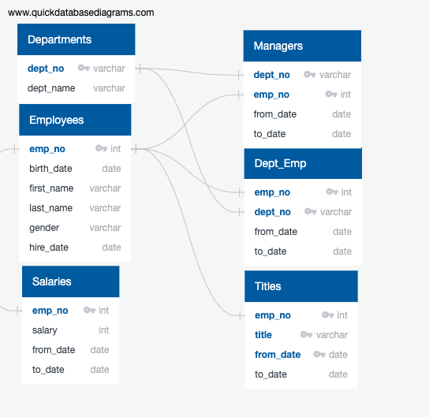

# Pewlett-Hackard-Analysis
 
## Overview of the Project

### Purpose 

Analyzing the employee database for Pewlett-Hackard company to perform employees research  related to number of employees retiring and total number of positions needed to be refilled which will help the company by generating list of all employees eligible for retirement package. 

The analysis were made based on the 6 csv files - departments.csv,employees.csv,dept_manager.csv,dept_emp.csv,salaries.csv and titles.csv.

### Initial Analysis

Initial analysis included identifying Primary key and Foreign key for all the csv files. Next, using the QuickDBD tool the  design structure for all the 6 tables were plotted along with primary and foreign key connection between the tables. 

Table structure of the Employee database.

 

• The Retirement Eligibility analyisis were made by running the queries on employees table and creating a new table named retirement_info.

[retirement_info](Data)

• Employee Information analysis was made based on list of employees containing their unique employee number, their last name, first name, gender, and salary.

[emp_info](Data)

• Management analysis was maded based on list of managers for each department, including the department number, name, and the manager's employee number, last name, first name, and the starting and ending employment dates.

[manager_info](Data)

• Department Retirees analysis was made based on an updated current_emp list that includes everything it currently has, but also the employee's departments.

[dept_info](Data)

• Retirement info related to the sales analysis was made based on the retirement info and sales team.

[retirement_sales_info](Data/retirement_sales_info.csv)

[retirement_sales_dev_info](Data/retirement_sales_dev_info.csv)

[queries.sql](Queries/queries.sql)  - Query file for the initial analysis

[schema.sql](schema.sql) - Schema file

### Updated Analysis 

The Purpose of the analysis is to determine the number of retiring employees per title and identify employees eligible to participate in a mentorship program. 

[Employee_Database_challenge.sql](Queries/Employee_Database_challenge.sql)  - Query file for the updated analysis 

## Result

The first table that determines the number of retiring employees and their position titles can be viewed here

[retiring_titles.csv](Data/retiring_titles.csv)

The second table that identifies employee who are eligible for the mentorship program can be viewed below

[mentorship_eligibilty.csv](Data/mentorship_eligibilty.csv)

From these tables, we can determine:
1. Majority of retirees are Senior Engineers, while next in line to retire includes the rest of the Senior Staff. 
2. Senior Engineer and Senior Staff positions have the greatest priority when it comes to deciding which roles the company would like to fill.
3. Among those that are retiring, there are 1,549 employees that qualify for the mentorship program. 
4. There are more people retiring than there are potential mentors, which means that the company would have to create an efficient program that can cover the difference between the number of people retiring and the number of people who can be trained to fill these positions.

## Summary 

To determine the number of roles to be filled as the "silver tsunami" begins to make an impact, we could create a graph to categorize the retirees into age groups. For each year, the company can hire the same number as to the amount of people that would be retiring, assuming that the retirement age is 65. As we used a list of people who were born between 1952 and 1955 in our analysis, we would have a different hiring event for each of the following four years.

Based on the mentorship program analysis, we do not have enough retirees to mentor the next generation of employees. Moving forward, we could create a query that gives us a list of people who are retiring at the end of the current year (and for each following year). From there, the company can manage how many younger employees need to be trained to fill up the retired positions.
